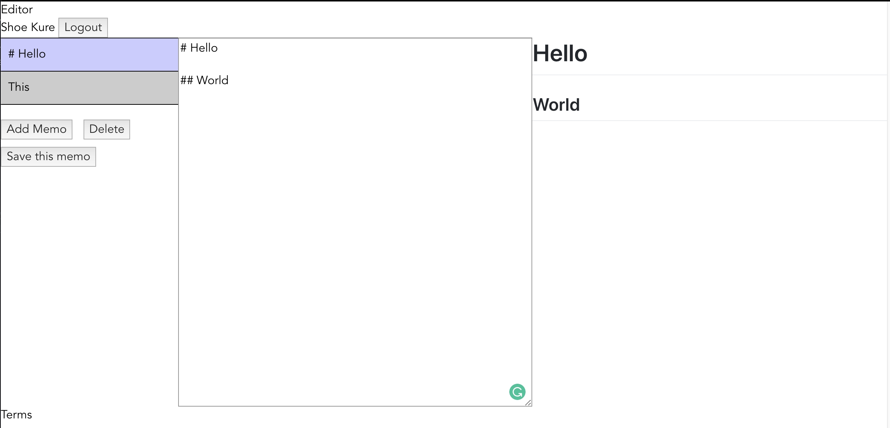

# My-Markdown-Memo

## Description

Markdown memo which can preview and edit on the same time.

**_DEMO:_**



## Usage / Install

Clone repo, cd into folder and run:

```console
$ npm install
$ npm run dev
```

## Requirement

- npm

## Tools

- Vue v2 cli
- Firebase
- Firebase realtime DB
- marked

## Licence

[MIT](./LICENSE.txt)

## Author

[Shoe Kure](https://github.com/roy1210)
